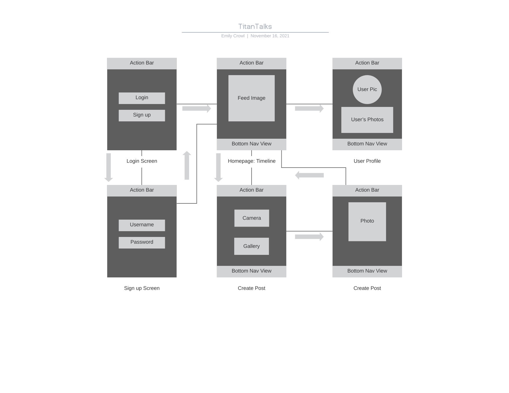

# TitanTalks

## Table of Contents
1. [Overview](#Overview)
2. [Product Spec](#Product-Spec)
3. [Wireframes](#Wireframes)
4. [Schema](#Schema)

## Overview
### Description
This application allows for CSUF students to connect in a new way. Users can share photos, videos, and host "talks" all from one application.

### App Evaluation
- **Category:** Social Media
- **Mobile:** Mobile allows for convenient use of this app. Users will be able to use the camera to take pictures
	            of the event they are at as well as easily upload any photos/videos from their phone.
- **Story:** Allows for a CSUF-personalized, mobile, and compact photo-sharing app that can be easily accessed from anywhere by the
             desired party.
- **Market:** Cal State Fullerton students.
- **Habit:** Students can upload photos, videos, or host live talks whenever they want.
- **Scope:** Version 1 will allow users to load a hard-coded feed of images. Version 2 will allow users to navigate between different pages. Version 3 will allow users to log in and their information is stored to the database. Version 4 will allow users to post images, view an image feed, and logout.

## Product Spec

### 1. User Stories (Required and Optional)

**Required Must-have Stories**

* User can login
* User can create a new account
* User can post a picture
* User can view a feed of media

**Optional Nice-to-have Stories**

* Users can post videos
* Users can host talks
* Users can edit posts
* Users can like posts
* Users can delete posts

### 2. Screen Archetypes

* Login Screen
   * User can login
* Account Registration Screen
   * User can create a new account
* Home Screen
   * User can view a feed of photos/videos/text
* Creation
   * User can post a photo/video/text message

### 3. Navigation

**Tab Navigation** (Tab to Screen)

* Home
* Profile
* Logout

**Flow Navigation** (Screen to Screen)

* Login Screen
   => Home
* Registration Screen
   => Home
* Home Screen
   => Login Screen
   => Creation
* Creation
   => Timeline

## Wireframes

## Schema 

### Models

### Networking
List of network requests by screen
- Timeline Feed Screen
  - (Read/GET) Query all posts where event is author
- Creation Screen
  - (Create/POST) Create a new post object

## SPRINT 1
- Architectural Spike
	- [X] Learn SQLite (basics)
	- [X] Learn Node.js/Feather.js
	- [X] Learn HTML
	- [X] Learn JavaScript
- [X] Hello World Code
- U01: 
	- [X] Create a database to store information
	- [X] Create a basic sign up form
	- [ ] Create an option to sign up on the login page
	- [ ] Insert the new account data into the DB
- U02:
	- [ ] Create login page design
	- [ ] Implement finalized UI for login page
	- [ ] Fetch existing user data from DB

- U13
	- [X] Create the timeline view on the homepage

### Issues
- WIP

## SPRINT 2
- WIP

### Issues
- WIP

## SPRINT 3
- WIP

### Issues
- WIP

## SPRINT 4
- WIP

### Issues
- WIP
